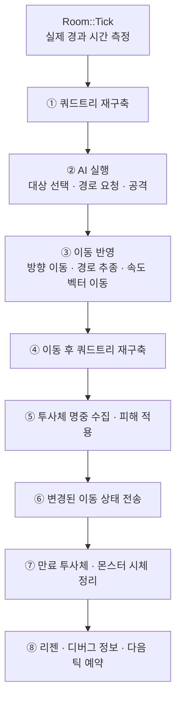
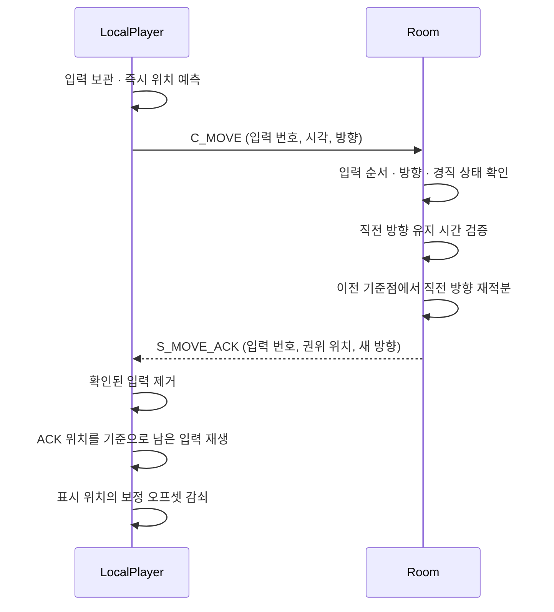
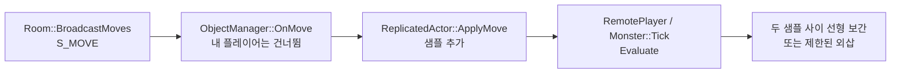
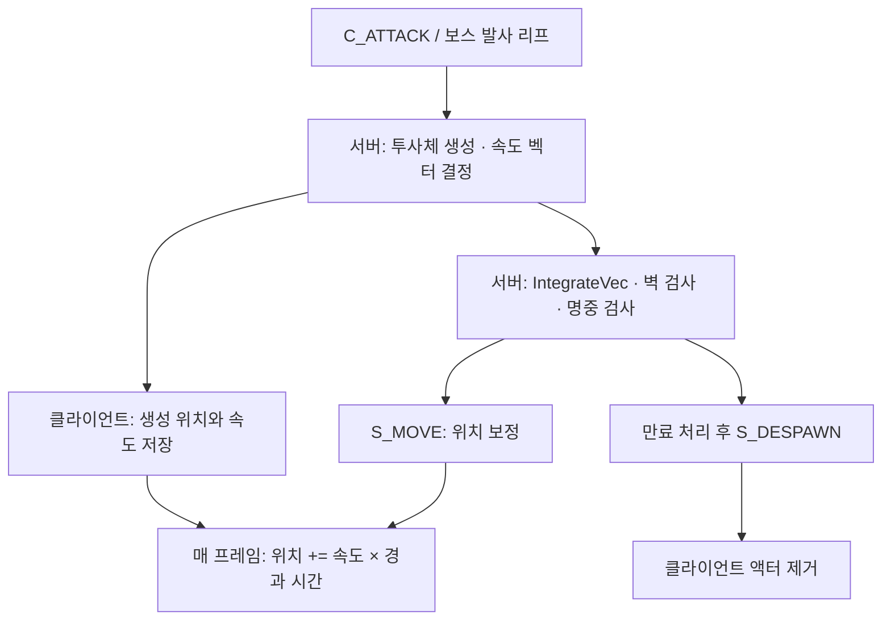
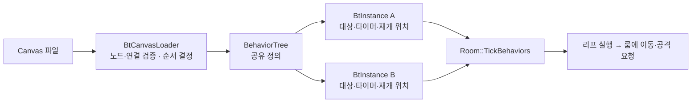
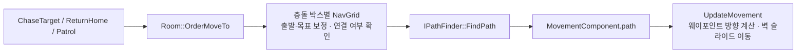
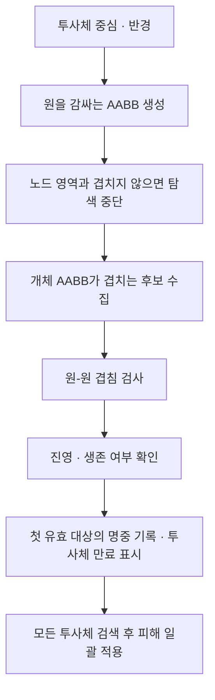

# Terminal Raid — 게임 서버

플레이어와 몬스터가 같은 월드에서 이동하고 전투하는 게임의 **전용 게임 서버**입니다. 서버가 위치·공격·피해·사망 상태를 결정하고, 클라이언트는 액터의 성격에 따라 **로컬 예측, 원격 보간, 투사체 데드레커닝**으로 움직임을 표현합니다.

> 이 문서는 현재 구현을 기준으로 작성한 기술 소개 초안입니다.
>
> 공통 통신 기반인 ServerCore는 기존 구조를 유지하였습니다. 여기서는 게임 서버의 이동 동기화, 몬스터 AI, 쿼드트리 충돌 판정을 다룹니다. 실행 흐름을 코드와 함께 따라가는 설명은 **[게임 서버 코드 읽기](docs/server-code-walkthrough.md)**에 정리했습니다.

---

## 프로젝트 소개

| 구성 | 역할 |
|---|---|
| `ServerProj` | 게임 월드, 이동 검증, AI, 전투·충돌 판정, 상태 전송 |
| `Submodules/ServerCore` | IOCP 통신, 세션, Job 큐, 메모리·로그 등 공통 기반 |
| `Common/Protobuf` | 서버와 클라이언트가 사용하는 패킷 정의 |
| `Data` | 맵 충돌 데이터, 액터 수치, 행동 트리 정의 |
| `Tools` | 패킷 생성, 액터 데이터 동기화, 서버 충돌 맵 생성 |

```text
Server/
├─ ServerProj/source/
│  ├─ Server.cpp                  # 초기화와 서버 실행
│  ├─ Room.*                      # 게임 틱, 이동, 전투, AI 실행 순서
│  ├─ GameSession.*               # 연결과 플레이어 연결
│  ├─ Protocol/                   # 패킷 처리와 생성 코드
│  ├─ Game/                       # 액터, 길찾기, 공간 검색, 데이터
│  ├─ AI/                         # 행동 트리 로더와 실행기
│  ├─ Shared/MovementMath.h        # 클라이언트와 동일하게 유지하는 이동 계산식
│  └─ Debug/GameCommands.*         # 상태 조회, 수동 실행, 비교 명령
├─ Common/Protobuf/
├─ Data/AI/
└─ Tools/
```

현재 월드는 전역 `GRoom` 하나입니다. 룸에 전달된 게임 작업은 같은 Job 큐에서 직렬로 처리합니다. 이후 설명하는 이동·AI·충돌도 이 룸 상태를 기준으로 동작합니다.

## 기술 스택

| 구분 | 내용 |
|---|---|
| 언어·툴셋 | C++20, MSVC v145, x64 |
| 통신·직렬화 | TCP / IOCP 기반 ServerCore, Protobuf |
| 이동 | 고정소수점 계산, 클라이언트 예측과 재조정, 지연 보간, 데드레커닝 |
| AI | Canvas 파일 기반 Behavior Tree, 개체별 Blackboard |
| 길찾기 | JPS, JPS 변형 2종, A* 비교 구조 |
| 충돌 | 정적 셀 격자, 동적 쿼드트리, 원 겹침 판정 |

## 목차

- [게임 서버의 처리 흐름](#게임-서버의-처리-흐름)
- [액터 이동과 동기화](#액터-이동과-동기화)
- [몬스터 AI](#몬스터-ai)
- [쿼드트리를 사용한 충돌 판정](#쿼드트리를-사용한-충돌-판정)
- [검증과 시연 항목](#검증과-시연-항목)
- [관련 코드와 문서](#관련-코드와-문서)

---

## 게임 서버의 처리 흐름

`Room::Tick()`은 목표 주기 50ms, 즉 20Hz로 월드를 갱신합니다. 실제 이동량과 AI 타이머에는 실행 사이에 측정한 경과 시간을 사용합니다. 지연이 누적되지 않도록 다음 틱의 예약 시간을 보정하고, 한 번에 반영하는 경과 시간은 최대 250ms로 제한합니다.



첫 번째 트리는 AI가 주변 대상을 찾을 때 사용합니다. 두 번째 트리는 이동이 끝난 위치에서 투사체와 액터의 겹침을 검사하기 위해 만듭니다. **AI가 보는 위치와 명중 판정이 보는 위치의 시점이 다르기 때문에** 한 틱에 두 번 구성합니다.

플레이어 입력 처리는 패킷에서 룸 작업으로 전달되며, 반드시 틱 시작까지 기다렸다가 실행되는 것은 아닙니다. `HandleMove()`의 ACK와 `Tick()`의 이동 브로드캐스트도 서로 다른 시점에 만들어집니다.

---

## 액터 이동과 동기화

### 액터에 따라 표현 방법을 나눈 이유

> **문제 상황**
>
> 직접 조작하는 캐릭터가 서버 응답을 기다리면 입력이 늦게 반영됩니다. 반대로 다른 플레이어와 몬스터는 앞으로 어떤 방향으로 움직일지 클라이언트가 알 수 없습니다. 발사 이후 등속 직진하는 투사체는 속도만 알면 다음 위치를 계산할 수 있습니다.

> **해결 방법**
>
> 서버가 결정한 상태를 기준으로 두되, 화면에 위치를 반영하는 방법을 액터별로 분리했습니다.

| 대상 | 클라이언트 처리 | 서버가 제공하는 기준 |
|---|---|---|
| 로컬 플레이어 | 즉시 예측하고 ACK 이후 미확인 입력을 재생 | 처리한 입력 번호, 고정소수점 위치, 방향 |
| 원격 플레이어·몬스터 | 수신 샘플 사이를 지연 보간 | 서버 틱, 고정소수점 위치, 방향·속도 |
| 투사체 | 생성 시 속도로 데드레커닝하고 수신 위치로 보정 | 생성 위치·속도 벡터, 위치 갱신, 제거 통지 |

이 세 가지는 **클라이언트의 이동 표현 방식**입니다. 서버 내부에는 별도로 방향 이동, AI 경로 추종, 투사체 속도 벡터 적분이 있습니다. 몬스터의 경로 추종은 AI에서 설명하고, 여기서는 그 결과가 화면까지 전달되는 흐름을 다룹니다.

### 공통 좌표와 벽 처리

서버의 이동 위치는 **1셀 = 256서브유닛**인 고정소수점으로 저장합니다. 예를 들어 `fpX = 2688`은 10.5셀이고, 정수 셀은 `fpX >> 8`로 얻습니다. 패킷에 `posSubX/Y`를 함께 보내므로 보정 과정에서 셀 내부 위치를 버리지 않습니다.

플레이어 예측과 서버의 방향 이동은 같은 `MovementMath.h` 계산식을 사용합니다. 전체 이동량을 먼저 구하고, 축별 변위가 최대 0.5셀인 조각으로 나누어 벽을 검사합니다. X축이 막히면 Y축 이동을 남기는 방식으로 벽을 따라 움직이고, 대각선 목적 셀이 막힌 경우도 검사합니다.

원격 액터의 보간과 투사체의 화면 좌표 계산은 표현을 위한 `float` 연산을 사용합니다. 또한 서버의 투사체 발사 방향 정규화에는 실수 연산이 들어가므로, 서버 전체가 정수 연산만 사용하는 구조는 아닙니다.

### ① 로컬 플레이어 예측과 서버 재조정

클라이언트는 방향이 바뀌거나 이동 중 250ms가 지나면 `C_MOVE`를 보냅니다. 패킷에는 위치 대신 `inputSeq`, `clientTick`, `dir`을 담습니다. 여기서 `clientTick`은 프레임 번호가 아니라 클라이언트에서 누적한 경과 시간(ms)입니다.



서버는 클라이언트가 주장한 이동 시간을 그대로 사용하지 않습니다. 직전 요청과 현재 요청 사이의 서버 처리 간격을 구하고, **서버 실측 간격 ±200ms** 안으로 이동 시간을 제한합니다. 초과 시간이 누적되면 경고를 기록합니다. 현재는 자동 제재까지 연결하지 않았습니다.

`IntegrateHeld()`는 매 틱 이동한 현재 위치에 이동량을 다시 더하지 않습니다. **이전 입력의 기준점으로 돌아가 직전 방향을 유지한 구간을 다시 계산**합니다.

```cpp
// Room::IntegrateHeld — 핵심 발췌
m.fpX = m.anchorFpX;
m.fpY = m.anchorFpY;

MoveMath::IntegrateSlide(m.fpX, m.fpY, ux, uy, m.EffectiveSpeed(), heldMs,
    [&](int32 cx, int32 cy) { return IsActorBoxBlocked(object, cx, cy); });

object->SyncCellFromFixed();
```

이렇게 확정한 위치가 다음 ACK의 기준점이 됩니다. 클라이언트는 해당 입력 이후의 기록을 재생하여 현재 예측 위치를 다시 구합니다. 따라서 ACK를 받았다고 과거 위치에 그대로 머무르지 않습니다.

예를 들어 100번 입력의 ACK를 기다리는 동안 101번 입력으로 방향을 바꿨다면, 100번까지 제거하고 **서버가 확인한 위치에서 101번 이후의 이동을 다시 계산**합니다. 작은 위치 차이는 표시용 오프셋으로 남긴 뒤 감쇠시키고, 축별 8셀을 넘는 보정은 즉시 반영합니다.

### ② 원격 액터의 지연 보간

다른 플레이어와 몬스터는 `S_MOVE`의 위치를 바로 화면에 덮어쓰지 않습니다. `MovementInterpolator`가 최대 32개 샘플을 보관하고, 최신 수신 틱보다 **4틱 뒤의 시점**을 목표로 재생합니다. 20Hz 기준 약 200ms의 지연입니다.



```cpp
// MovementInterpolator::EvaluateAt — 두 샘플 사이 보간
const Sample& a = _samples[i - 1];
const Sample& b = _samples[i];
const float span = b.tick - a.tick;
const float f = (span > 1e-4f) ? (time - a.tick) / span : 1.0f;
return { a.x + (b.x - a.x) * f, a.y + (b.y - a.y) * f };
```

재생 시점이 최신 샘플보다 앞서면 마지막 방향·속도로 외삽하며, 상한은 6틱입니다. 단, 샘플이 하나뿐인 경우는 그 위치를 유지합니다. 정지 샘플 뒤에 이동이 시작되거나 샘플 간격이 10틱을 넘으면 기존 샘플을 비우고 재생 기준을 다시 잡습니다.

서버는 바뀐 액터를 `dirty`로 표시하고 한 번의 `S_MOVE`에 묶어 보냅니다. 10틱마다 이동 중인 액터에 키프레임 갱신도 적용합니다. 로컬 플레이어의 위치 보정은 `S_MOVE_ACK`가 담당하며, 클라이언트는 `S_MOVE`에 포함된 자기 위치를 건너뜁니다.

### ③ 투사체의 데드레커닝

투사체는 서버가 발사를 승인한 뒤 생성합니다. 플레이어의 발사 주기는 서버 시계로 검사하고, 클라이언트가 보낸 발사 기준점은 서버 플레이어 위치에서 4셀 이내로 제한합니다. 이후 조준 방향을 정규화하여 고정된 속도 벡터를 만듭니다.



클라이언트의 `ProjectileActor::Tick()`은 보간 버퍼를 기다리지 않고 `renderX/Y += velCellsX/Y * deltaTime`으로 이동합니다. `S_MOVE`가 도착하면 9셀보다 큰 오차는 즉시 맞추고, 나머지는 수신 시점에 오차의 절반을 반영합니다.

서버의 `IntegrateVec()`는 이동을 잘게 나누어 목적 셀이 벽인지 확인합니다. 플레이어처럼 벽을 따라 미끄러지지 않고, 벽을 만난 직전 위치에서 멈춥니다. 종류별로 벽을 통과하는 투사체도 있으며, 사거리·수명·월드 이탈로도 제거됩니다. 실제 피해와 제거 여부는 서버가 결정합니다.

### 아쉬운 점

- **보간 시간축이 서버의 실제 경과 시간과 완전히 연결되어 있지 않습니다.** 서버는 `deltaMs`와 `serverTime`을 보내지만, 현재 보간기는 `serverTick × 20Hz` 기준을 사용합니다. 틱 지연이 클 때 두 시간축의 차이를 검토할 필요가 있습니다.
- **투사체 생성은 서버 응답 이후입니다.** 발사 전 클라이언트 예측 스폰이나 패킷 이동 시간을 고려한 위치 선행 보정은 없습니다.
- **좌표와 충돌 데이터의 일치가 필요합니다.** 이동 헤더는 양쪽에 복사되어 있고, 서버 충돌 맵은 클라이언트 배치에서 도구로 생성합니다. 한쪽만 변경하면 예측과 서버 판정이 달라질 수 있습니다.

---

## 몬스터 AI

### 공유 트리와 개체별 실행 상태

> **문제 상황**
>
> 같은 몬스터라도 추적 대상, 대기 시간, 돌아갈 위치는 서로 다릅니다. 반면 행동 순서와 조건은 같은 정의를 사용합니다.

> **해결 방법**
>
> 트리 정의와 리프는 공유하고, 진행 중인 자식 번호와 블랙보드는 개체마다 따로 보관했습니다.

| 구성 | 저장하는 내용 |
|---|---|
| `BehaviorTreeManager` | 이름별로 로드한 트리 캐시 |
| `BehaviorTree` | 평탄한 노드 배열, 자식 범위, 리프, 블랙보드 기본값 |
| `BtInstance` | 개체별 블랙보드, 컴포지트 재개 위치, 마지막 실행 상태 |
| `Blackboard` | 대상 ID, 재탐색 타이머, 복귀 상태, 홈 위치 등 |
| `BtLeafLibrary` | 탐색·추적·공격·순찰·복귀·방사형 발사 동작 |

`Data/AI/*.canvas`의 노드와 연결선을 읽어 실행용 트리를 구성합니다. 자식 순서는 연결선의 `[N]`, 노드 중심 X좌표, 노드 ID 순서로 결정합니다. 블랙보드 키도 로드 시 슬롯 번호로 바꾸므로 실행 중에는 슬롯으로 접근합니다.



### Running을 기억하는 실행기

`Sequence`는 자식이 실패하면 중단하고, `Selector`는 자식이 성공하면 중단합니다. `Running`을 반환한 자식이 있으면 해당 번호를 기억하고 다음 틱에 그 자식부터 이어갑니다.

```cpp
// BtInstance::Run — Sequence의 재개 처리 발췌
int16& resume = _compositeState[node.stateSlot];

for (int32 i = resume; i < node.childCount; i++)
{
    const BtStatus status = Run(node.firstChild + i, context);

    if (status == BtStatus::Running)
    {
        resume = static_cast<int16>(i);
        return BtStatus::Running;
    }
    // Failure이면 재개 위치를 초기화하고 종료합니다. 이후 처리는 생략했습니다.
}
```

이 방식에서는 오래 실행되는 자식 앞의 조건을 매 틱 다시 검사하지 않습니다. 그래서 현재 좀비 트리가 사용하는 `ChaseTarget`은 경로를 요청한 뒤 보통 `Success`로 끝냅니다. **이동의 지속은 `Room::UpdateMovement()`에 맡기고, 트리는 다음 틱에 근접 공격·복귀 조건부터 다시 확인**하게 합니다. `MoveToTarget` 리프도 구현되어 있지만 현재 기본 좀비 트리의 추적에는 `ChaseTarget`을 사용합니다.

### 좀비와 보스의 행동 구성

좀비 트리는 홈 위치 기록, 근접 재교전, 복귀, 추적, 순찰 순으로 분기를 확인합니다. 근접 공격은 `AttackTarget`에서 `DealDamage()`를 호출하고, 추적은 일정 간격 또는 경로가 없을 때 `OrderMoveTo()`로 경로를 갱신합니다.

보스는 HP 50% 이하 조건을 상위 분기에 두고, 대기 후 `FireRadialBurst`를 실행합니다. 기본 16갈래 발사에 회전 오프셋을 누적하고, 두 번째 페이즈에서는 추가 투사체를 섞습니다. `Wait`가 `Running`인 동안에는 앞의 HP·대상 조건을 다시 검사하지 않으므로, 페이즈 전환은 현재 실행 중인 분기를 마친 뒤 반영될 수 있습니다.

### 길찾기와 실제 이동의 연결

길찾기에는 액터 중심이 통과할 수 있는지만이 아니라 **그 위치에 액터의 충돌 박스 전체를 놓을 수 있는지**가 필요합니다. `Level`은 충돌 박스 크기별 `NavGrid`를 캐시하고, `NavGrid`는 누적합으로 박스 내부 장애물 유무를 계산합니다. 연결되지 않은 영역은 미리 라벨링하여 경로 탐색 전에 걸러냅니다.



기본 길찾기는 JPS이며, 방향 편향을 적용한 `jps_a`, 점프 스캔 상한을 둔 `jps_b`, A*로 교체할 수 있습니다. 현재 `jps_b`는 방향 편향과 상한을 함께 사용하는 구성이 아니라 **점프 상한만 사용하는 구성**입니다. 성능 우열은 맵·박스 크기·탐색 조건별 측정이 필요합니다.

### 아쉬운 점

- **실행 중인 분기를 선점하는 구조는 아닙니다.** `Running`을 유지하는 리프를 추가할 때 상위 조건의 재평가 시점을 함께 설계해야 합니다.
- **경로는 정적 장애물을 기준으로 합니다.** 다른 몬스터를 피하는 동적 회피나 액터끼리 밀어내는 처리는 포함하지 않았습니다.
- **트리를 재로드하면 개체별 상태가 초기화됩니다.** 로드 실패 시 기존 트리를 유지하지만, 성공하면 연결된 인스턴스를 새 트리에 다시 바인딩합니다.

---

## 쿼드트리를 사용한 충돌 판정

### 정적 장애물과 동적 액터의 구분

> **문제 상황**
>
> 투사체마다 모든 액터를 검사하면 개체 수가 늘어날수록 검사량도 증가합니다. 몬스터가 주변 플레이어를 찾는 작업에도 같은 공간 검색이 필요합니다.

> **해결 방법**
>
> 벽은 셀 격자로 검사하고, 동적 액터는 쿼드트리에 넣어 질의 영역과 겹치는 노드만 탐색하도록 구성했습니다.

| 판정 | 사용하는 형태 |
|---|---|
| 플레이어·몬스터와 벽 | 액터 충돌 박스와 `Level`의 장애물 셀 |
| 투사체와 벽 | 이동 조각의 목적 셀 |
| 투사체와 액터 | 쿼드트리의 AABB 검색 후 원 겹침 검사 |
| AI 대상 탐색 | 원 영역 검색 후 살아있는 플레이어 중 가까운 대상 선택 |

### 경계에 걸친 액터 처리

한 노드의 개체가 4개를 넘고 깊이가 4보다 작으면 영역을 분할합니다. 더 나눌 수 없는 폭·높이에서는 분할을 멈춥니다. 개체의 AABB 전체가 자식 영역에 들어갈 때만 내려보내고, 분할선에 걸친 개체는 부모 노드에 남깁니다.

```cpp
// QuadTree::Insert — 자식이 이미 존재하는 경우의 핵심 조건
if (node->children[i]->bounds.Contains(objectBounds))
{
    Insert(node->children[i], object, objectBounds);
    return;
}
```

하나의 개체를 여러 자식에 중복 등록하지 않기 때문에 검색 결과를 별도로 중복 제거할 필요가 없습니다. 대신 질의할 때 **현재 노드에 남은 개체를 검사하고, 겹치는 자식도 계속 방문**해야 합니다.

루트 경계는 맵 크기에서 시작해 살아있는 액터의 AABB까지 확장합니다. 맵 가장자리의 큰 액터가 루트 밖으로 걸쳤을 때, 질의 영역이 루트와 겹치지 않는다는 이유로 검색 전체가 생략되는 상황을 방지하기 위한 처리입니다.

### 넓은 후보 검사와 정확한 겹침 검사



`QueryCircle()`은 먼저 사각형으로 후보를 모은 뒤, 두 중심 사이 거리의 제곱과 반지름 합의 제곱을 비교합니다.

```cpp
// GameObject::OverlapsCircle
const int32 dx = _pos.x() - centerX;
const int32 dy = _pos.y() - centerY;
const int32 sum = _radius + radius;

return (dx * dx + dy * dy) <= (sum * sum);
```

플레이어 투사체는 몬스터를, 몬스터 투사체는 플레이어를 대상으로 합니다. 검색 결과에서 첫 유효 대상을 맞히면 만료 표시를 하고 검색을 끝냅니다. 이때 ‘첫 대상’은 검색 순서상 첫 대상이며, 이동 경로에서 가장 먼저 만난 대상이라는 의미는 아닙니다.

### 명중 수집과 피해 적용을 나눈 이유

검색 도중 피해를 적용하면 사망 처리에서 룸의 액터 목록이 바뀔 수 있습니다. 쿼드트리는 룸이 소유한 액터의 원시 포인터를 참조하므로, 검색과 객체 제거가 섞이지 않도록 명중 결과를 ID와 피해량으로 먼저 모읍니다.

```cpp
// Room::ResolveProjectileHits — 서로 다른 위치의 핵심 구문 발췌
struct Hit { uint64 attackerId; uint64 targetId; int32 damage; };
Vector<Hit> hits;

// 후보 검색 중
hits.push_back({ proj->GetOwnerId(), c->GetObjId(), proj->GetDamage() });
proj->MarkExpired();

// 모든 투사체의 후보 검색이 끝난 뒤
for (const Hit& h : hits)
    DealDamage(h.attackerId, h.targetId, h.damage);
```

`DealDamage()`는 HP를 변경하고 `S_HIT`, 사망 시 `S_DEATH`를 전송합니다. 플레이어는 사망 상태로 룸에 남아 리스폰을 기다리고, 몬스터는 설정된 사망 표현 시간에 따라 제거됩니다. 투사체는 틱 후반의 `SweepExpiredProjectiles()`가 제거합니다.

### 아쉬운 점

- **현재 액터 명중은 이동 후 위치에서 검사합니다.** 벽 검사에 이동 분할이 있더라도 액터와의 연속 충돌 판정까지 구현된 것은 아닙니다. 빠른 투사체가 한 틱 사이에 대상을 지나치는 경우에는 선분·스윕 기반 검사가 필요합니다.
- **쿼드트리를 한 틱에 두 번 재구축합니다.** 상태를 단순하게 유지하는 대신 재구축 비용이 있습니다. 개체가 분할선 근처에 몰리면 부모에 남는 개체가 늘어 검색 이점도 줄어듭니다.
- **만료 표시와 명중 검사 순서를 더 명확히 할 여지가 있습니다.** 이동 중 벽·사거리로 만료 표시된 투사체도 `ResolveProjectileHits()`에서 만료 틱을 별도로 거르지 않습니다. 최종 위치에서 명중을 허용할지 정책을 정리할 필요가 있습니다.

---

## 검증과 시연 항목

현재 코드에는 구조를 직접 확인하기 위한 명령과 오버레이가 있습니다. 아래는 **재현·측정 절차이며, 이번 문서 작성 과정에서 실행한 성능 결과는 아닙니다.**

| 주제 | 확인 방법 | 관찰할 내용 |
|---|---|---|
| 로컬 예측 | 이동·방향 전환·벽 슬라이드, F3 표시 | ACK와 현재 예측 위치의 관계, 보정 후 지속적인 좌표 이탈 여부 |
| 원격 보간 | 클라이언트 2개에서 상대 이동 확인 | 방향 전환, 정지 후 재이동, 샘플 공백 이후의 표시 |
| 투사체 | 플레이어 발사·보스 방사형 패턴 | 벽·액터 명중, 위치 보정, 제거 통지 |
| AI | `bt dump`, `bt state`, `bt step` | 자식 실행 순서, 대상·타이머, Running 재개 위치 |
| 길찾기 | `pathalgo`, `pathbench` | 확장 노드·검사 셀·시간, 박스 크기에 따른 통행 가능 영역 |
| 쿼드트리 | `tree`, `querytest`, `collision` | 분할 상태, 전수 검사와 결과 일치, 재구축·명중 처리 시간 |

길찾기는 `pathbench`로 동일 조건을 비교하고, 쿼드트리는 `querytest`로 전수 검사 결과와 대조할 수 있습니다. README에 성능 수치를 추가할 때는 빌드 구성, 개체 수와 배치, 반복 횟수, 측정 범위를 함께 기록해야 합니다.

## 관련 코드와 문서

- [게임 서버 코드 읽기](docs/server-code-walkthrough.md): 실행 흐름도, 핵심 코드 발췌, 변수의 의미, 브레이크포인트와 관찰 항목
- [Room.cpp](ServerProj/source/Room.cpp): 게임 틱, 이동 요청 처리, 경로 연결, 명중 처리
- [MovementMath.h](ServerProj/source/Shared/MovementMath.h): 고정소수점 이동과 벽 처리
- [BtInstance.cpp](ServerProj/source/AI/BtInstance.cpp): 행동 트리 실행과 재개
- [BtLeafLibrary.cpp](ServerProj/source/AI/BtLeafLibrary.cpp): 실제 몬스터 행동
- [QuadTree.cpp](ServerProj/source/Game/QuadTree.cpp): 삽입·분할·검색

문서 구성과 설명 방식은 기존 [console-game README](https://github.com/chibi1541/console-game/blob/main/README.md), [cpp-server README](https://github.com/chibi1541/cpp-server/blob/main/README.md)를 참고했습니다. 기술 내용은 Terminal Raid의 현재 코드를 기준으로 작성했습니다.
